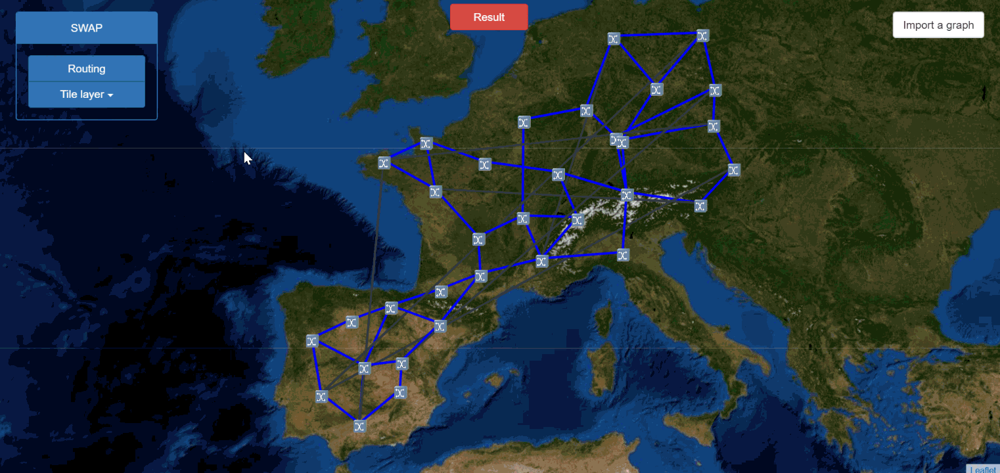
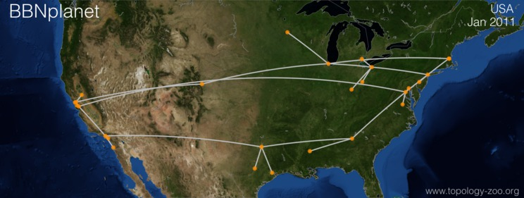
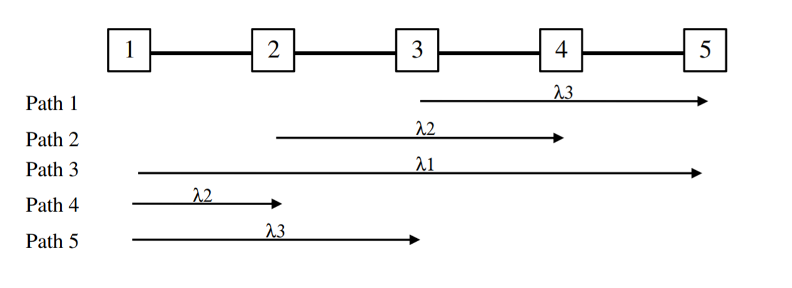
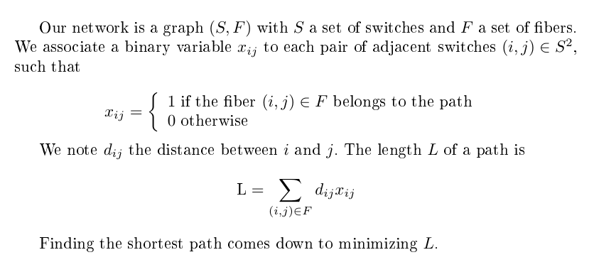
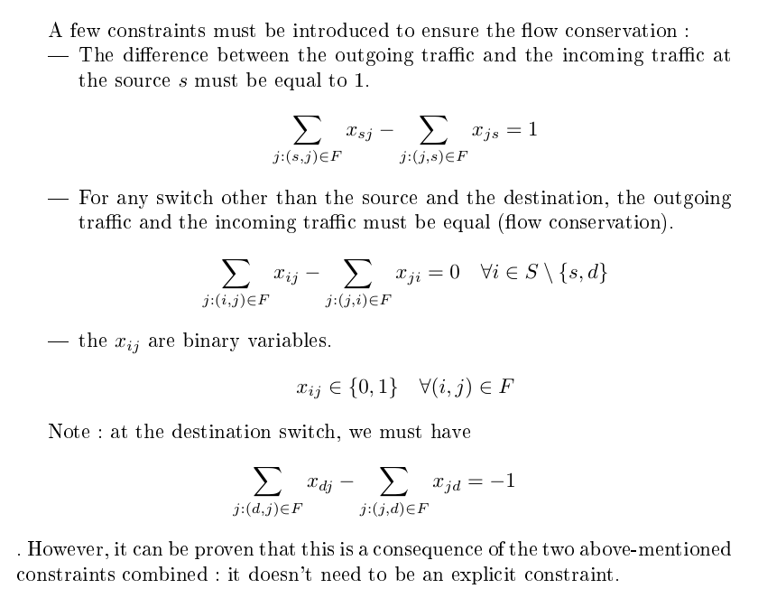
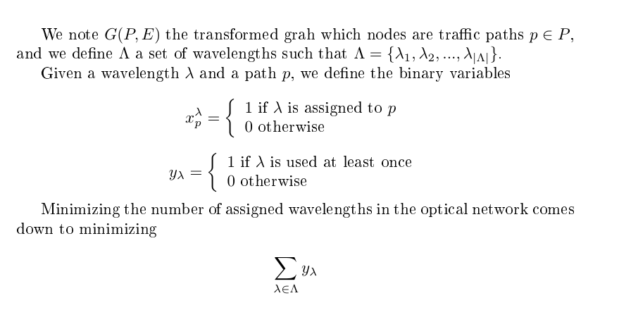
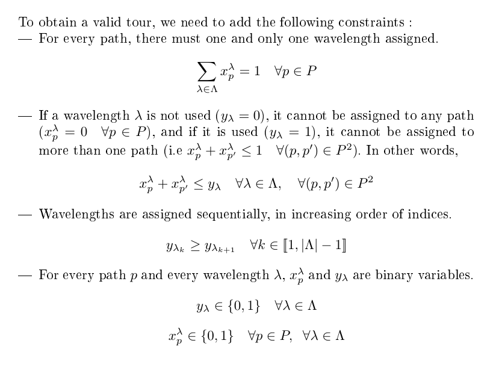
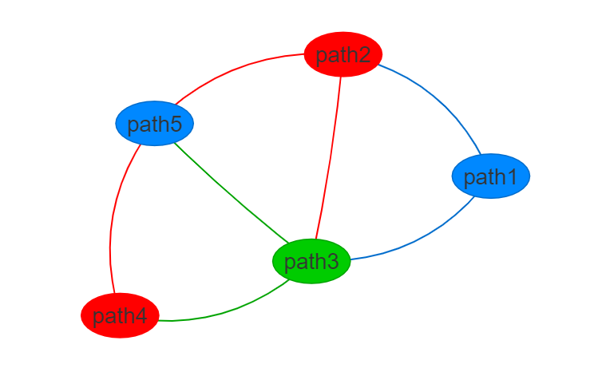
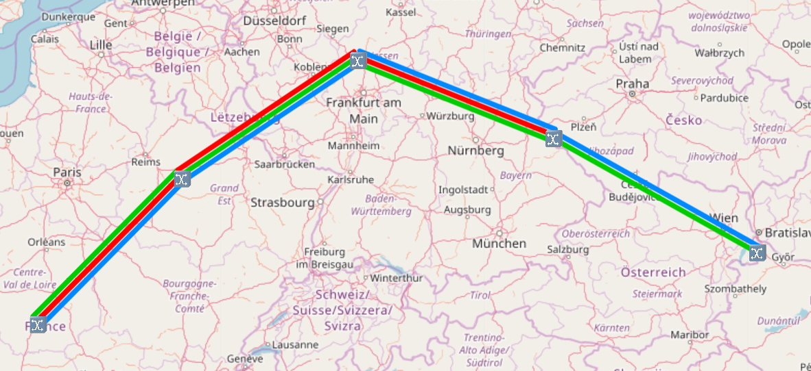
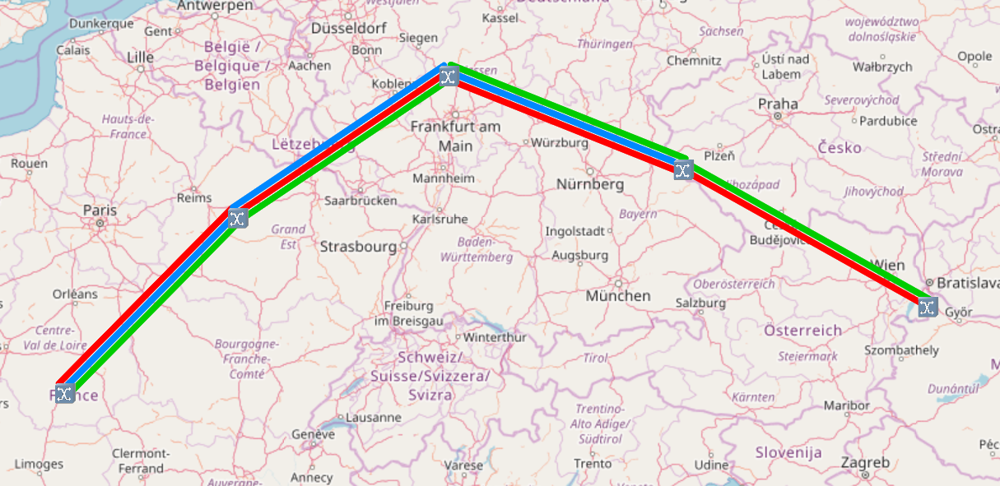

# Swap

In optical networks, the Wavelength Divison Multiplexing (WDM) technology is used to increase the capacity of fibers to transmit information, by splitting a beam of light into different wavelengths, which travel simultaneously.

In an all-optical network, a wavelength can cross an optical switch without Optical-Electrical-Optical (OEO) conversion. While this is a step forward towards cheaper and "greener" networks, a trade-off is that there has to be an end-to-end "wavelength continuity": a wavelength stays the same from the source edge to the destination edge, and it cannot be used by different lightpaths on the same optical fiber.

The wavelength allocation problem consists in finding the minimum number of wavelengths that are required, and how to allocate them to lightpaths.

Swap is a solver for the Routing and Wavelength Assignment Problem (RWA).

Two methods were implemented to solve the wavelength assignment problem:
- Linear programming (optimal solution)
- "Largest degree first" heuristic

You can find a [demo of Swap](http://minto3.pythonanywhere.com) applied to the BBN Planet backbone in the USA:

# A first example

Let's consider a situation with 5 optical switch in a line, and 5 traffic paths:
    

(image from [Linear Programming and Algorithms for Communication Networks](https://www.amazon.com/Linear-Programming-Algorithms-Communication-Networks/dp/1466552638) by Eiji Oki)

## Naive strategy: assign wavelengths in increasing order of path index

We will assign wavelength sequentially in increasing order of the traffic paths indices, and always choose the smallest available wavelength index.
 
We write the n-th wavelength Ln (lambda x), and the n-th path Pn.
- L1 is assigned to P1
- We cannot reuse L1 for P2, because P1 and P2 have a link in common. Therefore, L2 is assigned to P2.
- P3 uses all four fibers: we need a new wavelength L3.
- P4 does not share any fiber with P1 or P2: we choose the smallest available wavelength index: L1.
- Finally, P5 shares fibers with P2, P3 and P4: we need to use a new wavelength L4.

With this naive strategy, **4 wavelengths** are required.
The resulting assignment is the following:

(image from [Linear Programming and Algorithms for Communication Networks](https://www.amazon.com/Linear-Programming-Algorithms-Communication-Networks/dp/1466552638) by Eiji Oki)

## Another strategy: assign wavelengths in decreasing order of overlapping fibers

Another strategy consists in assigning wavelengths sequentially in decreasing order of the number of other paths with overlapping fibers:
- P3 shares fibers with all 4 paths
- P2 and P5 share fibers with 3 paths.
- P1 and P4 share fibers with 2 paths.

Therefore, we assign wavelengths sequentially in the following order of paths: P3, P2, P5, P1, P4:
- L1 is assigned to P3
- L2 is assigned to P2 (common fiber with P3)
- L3 is assigned to P5 (common fiber with P3 and P2)
- L3 can be reassigned to P1 (common fiber with P3 and P2, but not P5)
- L2 can be reassigned to P4 (common fiber with P3 and P5, but not P2)

With this new strategy, **3 wavelengths** are required.
The resulting assignment is the following:

(image from [Linear Programming and Algorithms for Communication Networks](https://www.amazon.com/Linear-Programming-Algorithms-Communication-Networks/dp/1466552638) by Eiji Oki)

The number of wavelengths required depends on the **order in which wavelengths are assigned** to the traffic paths.

The Wavelength Assignment Problem aims at **minimizing the number of wavelengths**.

# Algorithms

To solve the RWA, we consider that the traffic paths are known __a priori__, and that they all use the **shortest distance path**. This is called the **Static Lightpath Establishment Routing and Wavelength Assignment** problem (SLE RWA).

The SLE RWA is NP-complete, it can be reduced to a graph coloring problem with a simple graph transformation, as demonstrated below.

To solver the SLE RWA, we will go through the following steps:
  - **Routing**: for each path, we must find the shortest path. Instead of using Dijkstra algorithm, Swap uses the **integer linear programming formulation of the shortest path** problem for the routing process. The metric used to find the shortest path is the **geographic distance**, calculated with the **Haversine formula**.
  - **Graph transformation**: we create a new graph based on the optical network to turn the wavelength assignment process into a **graph coloring problem**.
  - **Wavelength assignment**: finally, we propose two algorithms to assign wavelengths: linear programming and the "Largest Degree First" heuristic.

## Find the shortest path with linear programming

## Reduction to a graph coloring problem

We can reduce the Wavelength Assignment Problem to a graph coloring problem with a simple graph transformation:
- Each traffic path is considered a vertex
- If two traffic paths share (at least) one fiber, they are connected with an edge.

Let's apply the graph transformation to our first example:
- There are five vertices in the transformed graph
- The following couples of paths share a fiber: (P1, P2), (P1, P3), (P2, P3), (P2, P5), (P3, P4), (P3, P5), (P4, P5). Their associated vertices are connected with an edge in the transformed.

We obtain the following result:

## Find the optimal wavelength assignment with linear programming

## "Largest degree first" heuristic

The linear programming solution, while it always yields an optimal solution, is not scalable: it cannot be applied to large networks. The "Largest degree first" is a simple heuristic that assigns colors in decreasing order of vertex degree in the transformed graph:

1. Find the uncolored vertex with largest degree
2. Assign the minimum indexed color not yet used by adjacent vertices.
3. Repeat step 1 and 2 until all vertices are colored.

# Similar projects you might be interested in:
    
- [A vendor-agnostic NMS for graphical network automation](https://github.com/afourmy/eNMS) 
- [A 2D/3D visualization of the Traveling Salesman Problem main heuristics](https://github.com/afourmy/pyTSP)
- [A vendor-agnostic NMS for network simulation and network optimization](https://github.com/afourmy/pyNMS) 
- [A 3D visualization of the Internet topology Zoo with Google Earth](https://github.com/afourmy/3D-internet-zoo)

# Installation

### (Optional) Set up a [virtual environment](https://docs.python.org/3/library/venv.html) 

### 1. Get the code
    git clone https://github.com/afourmy/swap.git
    cd swap

### 2. Install requirements 
    pip install -r requirements.txt

### 3. Set the FLASK_APP environment variable
    (Windows) set FLASK_APP=app.py
    (Unix) export FLASK_APP=app.py

### 4. Run the application
    flask run --host=0.0.0.0

### 5. Go the http://127.0.0.1:5000/

### 6. Create an account and log in

# Run swap in a docker container

### 1. Download & run the container
    docker run -d -p 5000:5000 --name swap --restart always afourmy/swap

### 2. Go to http://127.0.0.1:5000

### 3. Create an account and log in

# Credits

[Bootstrap](https://getbootstrap.com/ "Bootstrap"): Front-end HTML/CSS framework.

[Flask](http://flask.pocoo.org/ "Flask"): A microframework based on the Werkzeug toolkit and Jinja2 template engine.

[Flask SQLAlchemy](http://flask-sqlalchemy.pocoo.org/ "Flask SQLAlchemy"): Adds support for SQLAlchemy to Flask.

[Internet Topology Zoo](http://www.topology-zoo.org): A project to collect data network topologies from around the world..

[Jquery](https://jquery.com/ "Jquery"): JavaScript library designed to simplify the client-side scripting of HTML.

[Leaflet](http://leafletjs.com/ "Leaflet"): JavaScript library for mobile-friendly interactive maps.

[Leaflet-polyline](https://github.com/bbecquet/Leaflet.PolylineDecorator "Leaflet polyline"): A leaflet plugin to define patterns on Polylines.

[Linear Programming and Algorithms for Communication Networks](https://www.amazon.com/Linear-Programming-Algorithms-Communication-Networks/dp/1466552638) by Eiji Oki.

[Vis](http://visjs.org): A dynamic, browser based JavaScript visualization library.

[xlrd](https://github.com/python-excel/xlrd): Library to extract data from Microsoft Excel (tm) spreadsheet files.
